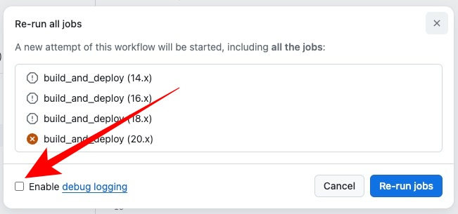

## Thursday May 2nd - Monday May 6th
### CI/CD issues with GreenPets

Workflow Version #6
```
name: CI/CD Workflow

on:
  push:
    branches:
      - main
  workflow_dispatch:

jobs:
  build_and_deploy:
    runs-on: ubuntu-latest

    strategy:
      matrix:
        node-version: [14.x, 16.x, 18.x, 20.x]

    steps:
    - name: Checkout Repository
      uses: actions/checkout@v3

    - name: Set up Node.js (client & server)
      uses: actions/setup-node@v3
      with:
        node-version: ${{ matrix.node-version }}
        cache: 'npm'

    - name: Install Client Dependencies
      working-directory: client
      run: npm install

    - name: Test Client
      working-directory: client
      run: npm run test

    - name: Build Client
      working-directory: client
      run: npm run build

    - name: Install Server Dependencies
      working-directory: server
      run: npm install

    - name: Deploy to Production
      if: github.ref == 'refs/heads/main'
      run: |
        heroku git:remote -a ${{ secrets.HEROKU_APP_NAME }}
        git push heroku main:main
      env:
        HEROKU_API_KEY: ${{ secrets.HEROKU_API_KEY }}
```

**NOTE**: To replicate all the build errors, can rerun the individual workflow versions within GitHub actions and view the debugging error log:




### Adjustments from workflow #6 to #7
- Removed node-version `14.x, 16.x` from the strategy -> matrix -> node versions. Node 16 is now deprecated
  - [Blog of explanation here](https://github.blog/changelog/2023-09-22-github-actions-transitioning-from-node-16-to-node-20/)

### Adjustments from workflow #7 to #16
- Under `jobs:` step, added `environment: greenpets` to explicitly point to the greenpets repository since other repos exists within the organization
- Was testing updating the `HEROKU_APP_NAME` and `HEROKU_API_KEY` secrets
  - To properly obtain `HEROKU_APP_NAME`:
    1. navigate to server folder in project
    2. Log into heroku: `heroku login` in vscode terminal
    3. Check apps that are assigned to current profile: `heroku apps`
    4. Look up details of particular app: `heroku info APP_NAME__HERE`, example: `heroku info greenpets`
    5. The `=== greenpets` is valdiation that app name is `green pets`
    6. Mistakenly thought it was a portion of the `web url` info before


Error message from  deployment:
```
##[debug]Result: 'heroku git:remote -a ***
##[debug]git push heroku main:main
##[debug]'
##[debug]Loading env
Run heroku git:remote -a ***
##[debug]/usr/bin/bash -e /home/runner/work/_temp/dca3f13d-3b5d-49f1-acc0-dd089f1dd52e.sh
 ›   Warning: Our terms of service have changed: 
 ›   https://dashboard.heroku.com/terms-of-service
set git remote heroku to https://git.heroku.com/***.git
fatal: could not read Username for 'https://git.heroku.com': No such device or address
Error: Process completed with exit code 128.
##[debug]Finishing: Deploy to Production
```

Another recurring error we received is logged from heroku user dashboard:
```
-----> Building on the Heroku-22 stack
-----> Using buildpack: heroku/nodejs
-----> Node.js app detected
       
-----> Creating runtime environment
       
       NPM_CONFIG_LOGLEVEL=error
       NODE_VERBOSE=false
       NODE_ENV=production
       NODE_MODULES_CACHE=true
       
-----> Installing binaries
       engines.node (package.json):   21.x
       engines.npm (package.json):    unspecified (use default)
       
       Resolving node version 21.x...
       Downloading and installing node 21.7.3...
       Using default npm version: 10.5.0
       
-----> Restoring cache
       Cached directories were not restored due to a change in version of node, npm, yarn or stack
       Module installation may take longer for this build
       
-----> Installing dependencies
       Installing node modules
       npm notice 
       npm notice New minor version of npm available! 10.5.0 -> 10.7.0
       npm notice Changelog: <https://github.com/npm/cli/releases/tag/v10.7.0>
       npm notice Run `npm install -g npm@10.7.0` to update!
       npm notice 
       npm ERR! code EUSAGE
       npm ERR! 
       npm ERR! `npm ci` can only install packages when your package.json and package-lock.json or npm-shrinkwrap.json are in sync. Please update your lock file with `npm install` before continuing.
       npm ERR! 
       npm ERR! Missing: react@18.3.1 from lock file
       npm ERR! Missing: react-dom@18.3.1 from lock file
       npm ERR! Missing: styled-components@6.1.9 from lock file
       npm ERR! Missing: loose-envify@1.4.0 from lock file
       npm ERR! Missing: js-tokens@4.0.0 from lock file
       npm ERR! Missing: scheduler@0.23.2 from lock file
       npm ERR! Missing: @emotion/is-prop-valid@1.2.1 from lock file
       npm ERR! Missing: @emotion/unitless@0.8.1 from lock file
       npm ERR! Missing: @types/stylis@4.2.0 from lock file
       npm ERR! Missing: css-to-react-native@3.2.0 from lock file
       npm ERR! Missing: csstype@3.1.2 from lock file
       npm ERR! Missing: postcss@8.4.31 from lock file
       npm ERR! Missing: shallowequal@1.1.0 from lock file
       npm ERR! Missing: stylis@4.3.1 from lock file
       npm ERR! Missing: tslib@2.5.0 from lock file
       npm ERR! Missing: @emotion/memoize@0.8.1 from lock file
       npm ERR! Missing: camelize@1.0.1 from lock file
       npm ERR! Missing: css-color-keywords@1.0.0 from lock file
       npm ERR! Missing: postcss-value-parser@4.2.0 from lock file
       npm ERR! Missing: nanoid@3.3.7 from lock file
       npm ERR! Missing: picocolors@1.0.0 from lock file
       npm ERR! Missing: source-map-js@1.2.0 from lock file
       npm ERR! 
       npm ERR! Clean install a project
       npm ERR! 
       npm ERR! Usage:
       npm ERR! npm ci
       npm ERR! 
       npm ERR! Options:
       npm ERR! [--install-strategy <hoisted|nested|shallow|linked>] [--legacy-bundling]
       npm ERR! [--global-style] [--omit <dev|optional|peer> [--omit <dev|optional|peer> ...]]
       npm ERR! [--include <prod|dev|optional|peer> [--include <prod|dev|optional|peer> ...]]
       npm ERR! [--strict-peer-deps] [--foreground-scripts] [--ignore-scripts] [--no-audit]
       npm ERR! [--no-bin-links] [--no-fund] [--dry-run]
       npm ERR! [-w|--workspace <workspace-name> [-w|--workspace <workspace-name> ...]]
       npm ERR! [-ws|--workspaces] [--include-workspace-root] [--install-links]
       npm ERR! 
       npm ERR! aliases: clean-install, ic, install-clean, isntall-clean
       npm ERR! 
       npm ERR! Run "npm help ci" for more info
       
       npm ERR! A complete log of this run can be found in: /tmp/npmcache.6Nbty/_logs/2024-05-02T23_16_41_016Z-debug-0.log
-----> Build failed
       
       We're sorry this build is failing! You can troubleshoot common issues here:
       https://devcenter.heroku.com/articles/troubleshooting-node-deploys
       
       If you're stuck, please submit a ticket so we can help:
       https://help.heroku.com/
       
       Love,
       Heroku
       
 !     Push rejected, failed to compile Node.js app.
 !     Push failed
```

Another common error message provided as `Annotations`:
```
build_and_deploy (20.x)
Node.js 16 actions are deprecated. Please update the following actions to use Node.js 20: actions/checkout@v3, actions/setup-node@v3. For more information see: https://github.blog/changelog/2023-09-22-github-actions-transitioning-from-node-16-to-node-20/.
```

- This log was manually triggered from the user dashboard
- **Note** Had to update `heroku`, `npm` & `node`  versions, globally in my local environment. These updates will also impact the rest of the team
  - This process required to update `brew` locally and address outdated `casks` and `formulae`
    - **Formulae:** In Homebrew, a "formulae" is a package script writtein in Ruby. This script contains instructions for Homebrew on how to install a piece of software and its dependencies. Formulae are primarily for command-line software or any applications that don't have a graphical user interface (GUI).
    - **Casks:** Extends the capabilities of formulae to allow management of graphical applications and large binary files, which are typically applications with a GUI. Casks make it easy to install and manage macOS desktop applications and larger binary distributions through Homebrew.
  - Required to manually uninstall node 16 and update to 22

### npm ci

- `npm ci` will install directly from `package-lock.json` and assumes that this file is up to date with `package.json`. It will not update the lock file; if there are discrepancies between `package.json` and `package-lock.json`, it will throw an error.

Resources for `npm ci` usage and context:

[npm GitHub issues thread explains package-lock.json bug](https://github.com/npm/cli/issues/5125)
[Explanation to why npm ci can cause issues](https://github.com/npm/cli/issues/5113)
[Thread supporting use of npm ci over npm install](https://github.com/actions/setup-node/pull/103)


- During the process of updating node, we explicitly added the following, within all the `package.json` files (client, server, root). This ensured that the latest node version was used in executing any of the scripts
```
"engines": {
  "node": "22.x",
}
```

To address this error:
```
     npm ERR! code EUSAGE
       npm ERR! 
       npm ERR! `npm ci` can only install packages when your package.json and package-lock.json or npm-shrinkwrap.json are in sync. Please update your lock file with `npm install` before continuing.
       npm ERR! 
       npm ERR! Missing: react@18.3.1 from lock file
       npm ERR! Missing: react-dom@18.3.1 from lock file
       npm ERR! Missing: styled-components@6.1.9 from lock file
       npm ERR! Missing: loose-envify@1.4.0 from lock file
       npm ERR! Missing: js-tokens@4.0.0 from lock file
       npm ERR! Missing: scheduler@0.23.2 from lock file
       npm ERR! Missing: @emotion/is-prop-valid@1.2.1 from lock file
       npm ERR! Missing: @emotion/unitless@0.8.1 from lock file
       npm ERR! Missing: @types/stylis@4.2.0 from lock file
       npm ERR! Missing: css-to-react-native@3.2.0 from lock file
       npm ERR! Missing: csstype@3.1.2 from lock file
       npm ERR! Missing: postcss@8.4.31 from lock file
       npm ERR! Missing: shallowequal@1.1.0 from lock file
       npm ERR! Missing: stylis@4.3.1 from lock file
       npm ERR! Missing: tslib@2.5.0 from lock file
       npm ERR! Missing: @emotion/memoize@0.8.1 from lock file
       npm ERR! Missing: camelize@1.0.1 from lock file
       npm ERR! Missing: css-color-keywords@1.0.0 from lock file
       npm ERR! Missing: postcss-value-parser@4.2.0 from lock file
       npm ERR! Missing: nanoid@3.3.7 from lock file
       npm ERR! Missing: picocolors@1.0.0 from lock file
       npm ERR! Missing: source-map-js@1.2.0 from lock file
```
***FINALLY*** realized that the root `package.json` had three dependencies that did not need to be there (react, react-dom, styled-components). There was also no `package-lock.json` file or `node_modules`. The previous time was focused on `client` and `server` folder which was not were the issue actually was.

Removing these unnecessary dependencies results in a successful manual deployment from **heroku** but got **github actions**. 

Error from deployment logs:
```
Run git config --global user.name "Kevin Phan"
##[debug]/usr/bin/bash -e /home/runner/work/_temp/1d399a52-4f16-4e89-b193-12893abb3fef.sh
 ›   Warning: Our terms of service have changed: 
 ›   https://dashboard.heroku.com/terms-of-service
set git remote heroku to https://git.heroku.com/***.git
fatal: could not read Username for 'https://git.heroku.com': No such device or address
Error: Process completed with exit code 128.
```

To address the error where the authentication credentials could not be validated through github actions, we needed to insert additional configurations in the CI/CD workflow. The additions were:
```
    - name: Deploy to Production
      if: github.ref == 'refs/heads/main'
      run: |
        git config --global user.name "Kevin Phan"
        git config --global user.email "kevinphan.dev@gmail.com"
        heroku git:remote -a ${{ secrets.HEROKU_APP_NAME }}
        git push heroku main:main
      env:
        HEROKU_API_KEY: ${{ secrets.HEROKU_API_KEY }}
```

The `user.name` and `user.email` inputs here will be assigned to every triggered CI/CD workflow. This is for documenting purposes. 
- Currently still dealing with :
`fatal: could not read Username for 'https://git.heroku.com': No such device or address`